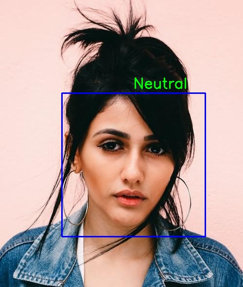

# Facial Recognition and Emotion Detection
----------
 
----------

### Emotion Detection

Testing

   The model was tested with sample images. It can be seen below:

   
   
    

#### The model will be able to detect 7 types of emotions:-
 #####  Angry , Sad ,  Neutral ,  Disgust ,  Surprise ,  Fear  , and   Happy

## Usage:

### For  Face Detection, and Emotion Detection Code

Refer to the notebook /Emotion_Detection.ipynb. 
I have trained an emotion detection model and put its trained weights at /Models

### Train your Emotion Detection Model
To train your own emotion detection model, Refer to the notebook /facial_emotion_recognition.ipynb

### For Emotion Detection  using Webcam 

